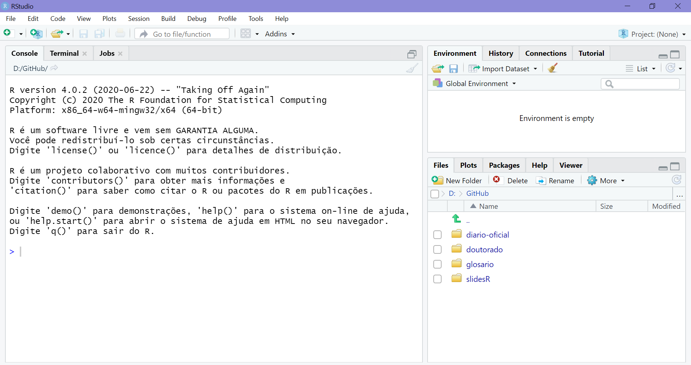
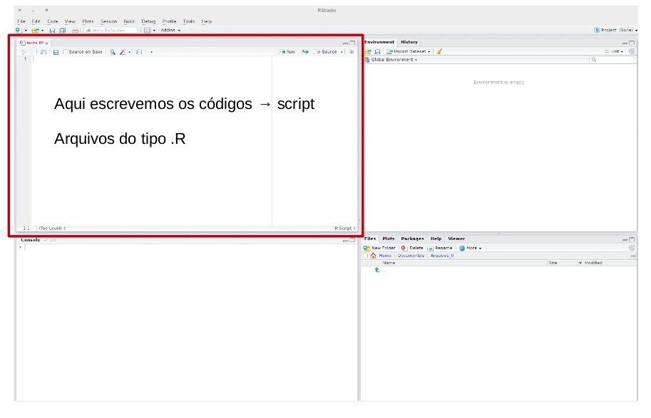
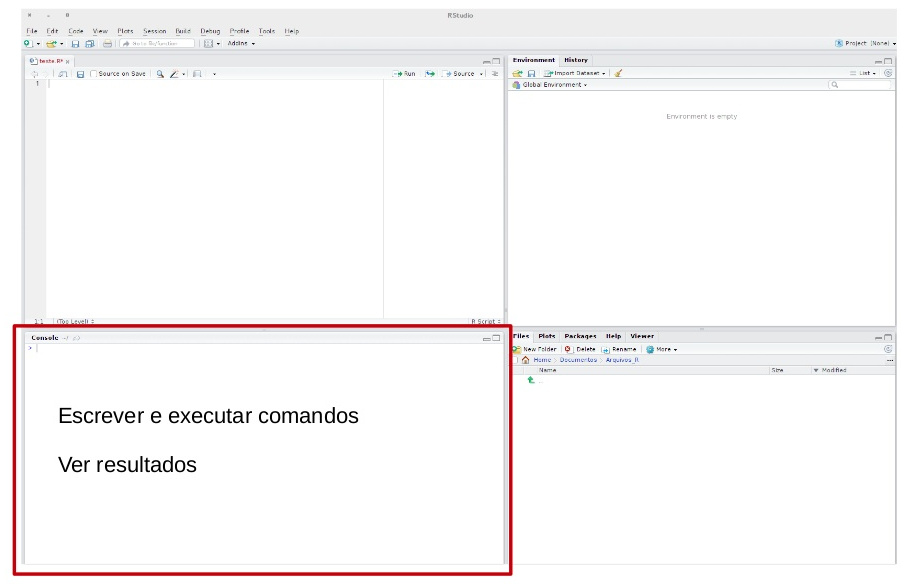
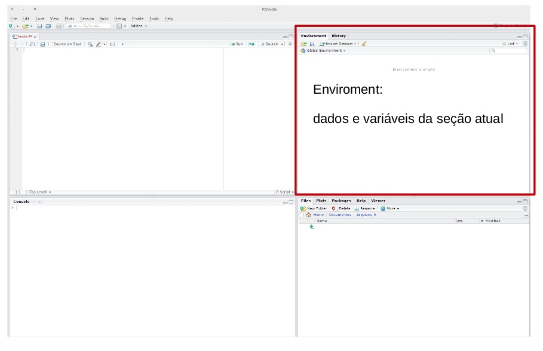
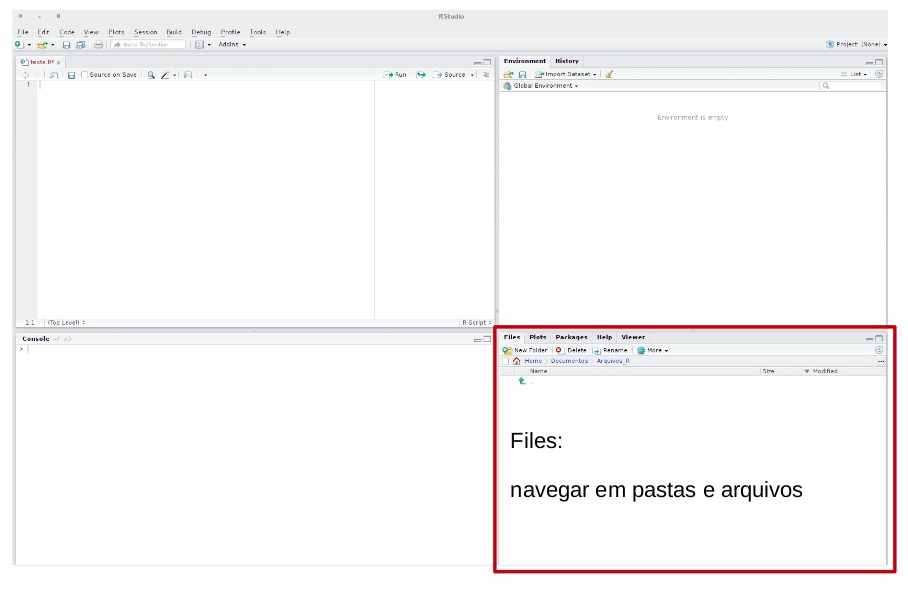
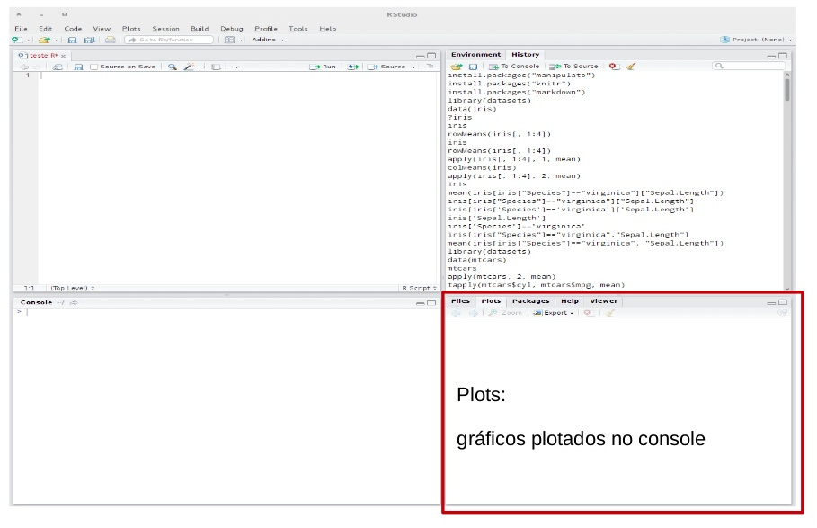
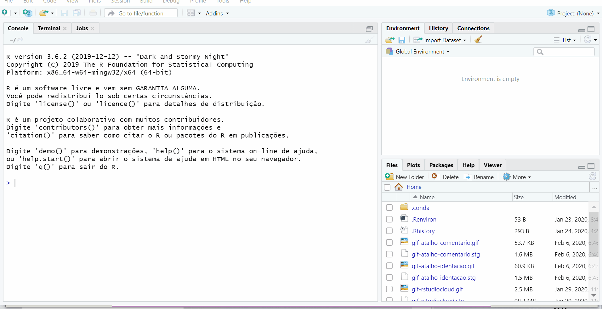

## {.title-slide}

::: {.columns}

::: {.column width="50%"}

<br><br>

# Introdução ao R aplicado à Econometria

::: {.subtitle}
Do banco de dados à estimação de uma regressão linear
:::

<br>

::: {.author}
Luísa Gisele Böck
:::

::: {.info}
Econometria I  
Universidade Federal de Santa Maria
:::

::: {.year}
2026
:::

:::


::: {.column width="50%"}

```{r}
#| echo: false
#| out-width: 90%

knitr::include_graphics(
  "img/00-intro-allison-horst.png"
)
```

:::

:::

---

## O que é o R? {.slide-r}

::: {.columns}

::: {.column width="60%"}

> “R é um ambiente de software livre para computação estatística e gráficos.”

<br>

**Por que usar o R?**

- é gratuito e de código aberto;
- possui ferramentas para análise de dados;
- permite estimar modelos estatísticos e econométricos;
- facilita a produção de gráficos, tabelas e relatórios;
- contribui para análises reprodutíveis.

:::

::: {.column width="40%"}

<br>
<br>
<br>

```{r}
#| echo: false
#| out-width: 55%
#| fig-align: center


```

:::

:::

---

## RStudio {.slide-rstudio}

**RStudio** é onde escrevemos, organizamos e executamos códigos em R.

```{r}
#| echo: false
#| out-width: 95%
#| fig-align: center


```

---

## Conhecendo o RStudio: script {.slide-conhecendo}

**Script** é onde escrevemos e salvamos os códigos da análise. Arquivos do tipo `.R`.

```{r}
#| echo: false
#| out-width: 95%
#| fig-align: center


```

---

## Conhecendo o RStudio: console {.slide-conhecendo}

**Console** é onde os comandos são executados e os resultados aparecem.

```{r}
#| echo: false
#| out-width: 95%
#| fig-align: center


```

---
 
## Conhecendo o RStudio: environment {.slide-conhecendo}

**Environment** mostra os objetos criados durante a análise. 

```{r}
#| echo: false
#| out-width: 95%
#| fig-align: center


```

---

## Conhecendo o RStudio: files e plots {.slide-conhecendo}

::: {.columns}

::: {.column width="50%"}

**Files**

Permite navegar pelos arquivos e pastas do projeto.

```{r}
#| echo: false
#| out-width: 100%


```

:::

::: {.column width="50%"}

**Plots**

Mostra os gráficos produzidos no R.

```{r}
#| echo: false
#| out-width: 100%


```

:::

:::

---

## O ciclo de uma análise empírica no R


```{r}
#| echo: false
#| out-width: 80%
#| fig-align: center


```

---

## Projetos no RStudio {.slide-projetos}

Um **Projeto** reúne todos os arquivos de uma análise em uma única pasta.

<br>

::: {.estrutura-projeto}

```text
analise-econometria/
├── dados/
│   ├── ideb.csv
│   └── pib.csv
│
├── scripts/
│   └── aula.R
│
└── resultados/
    ├── graficos/
    └── tabelas/
```

:::

::: {.highlight}

Um projeto facilita a organização e torna a análise reprodutível. 

Crie um projeto para cada nova análise.

:::

---

## Criando um projeto no RStudio {.slide-projetos}

**File → New Project → New Directory**

<br>

```{r}
#| echo: false
#| out-width: 100%
#| fig-align: center


```

---

## Caminhos dos arquivos

Caminhos indicam onde o `R` deve procurar e salvar arquivos.

<br>

::: {.callout-important title="Caminho absoluto"}
```text
C:/Users/Luisa/Desktop/aula/dados/ideb.csv
```

Depende da organização do seu computador.
:::

<br>

::: {.callout-note title="Caminho relativo"}
```text
dados/ideb.csv
```

Usa como referência a pasta do projeto.
:::

<br>

::: {.callout-tip title="Projeto do RStudio"}
Ao abrir o `.Rproj`, o `R` encontra arquivos usando a pasta do projeto como referência.
:::

---

## {.slide-vamos}

::: {.texto-vamos}

Vamos ao R!

:::
